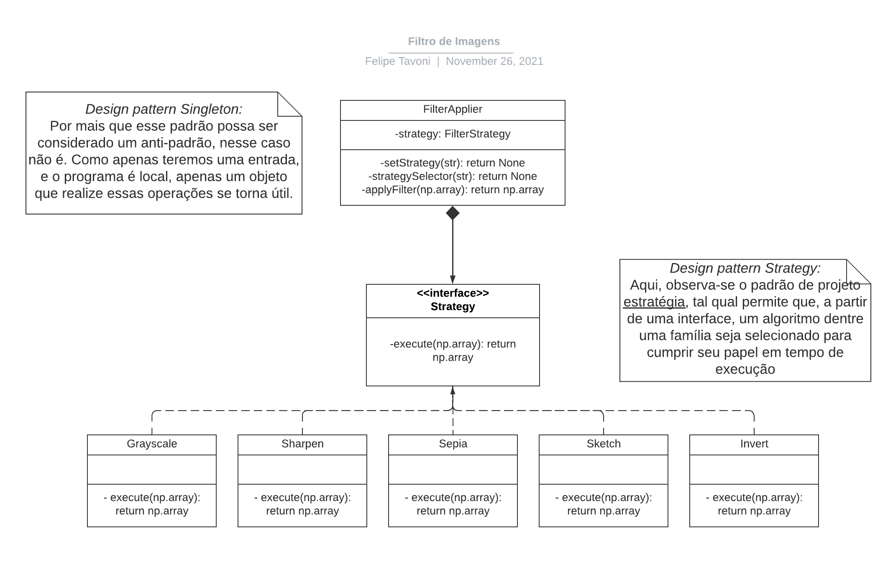

<h1 align="center"> 
    Princípio da Inversão de Dependência
</h1>

<p align="center">
	<a href="#-O-que-é-?">O que é ?</a> |
	<a href="#-exemplos">Exemplos</a> |
	<a href="#-como-executar">Como executar</a>
</p>

## 🔍 O que é ?

O Princípio da Inversão de Dependência (DIP) esclarece que um módulo de alto nível não deve depender de implementações, mas sim de abstrações, ou seja, módulos que se encontram em níveis mais altos não devem depender de implementações concretas. Como solução para essa dependência, o princípio sugere que tais dependências dependam de uma mesma abstração.
A seguir, será apresentada um exemplo a partir da implementação de uma aplicação que busca operar um filtro sobre imagens de entrada. 

---

## 💻 Exemplos

Para ilustar esse princípio, consideremos uma aplicação que aplica filtros sobre uma imagem de entrada. O código completo pode ser consultado [aqui](./main.py) neste diretório. 

De início, temos a arquitetura do projeto, ilustrado abaixo. Neste, podemos observar o padrão arquitetural de camadas, dado que classes acessam métodos próprios e de classes inferiores. Além disso, observamos o *design pattern Strategy*, que cuida da família de algoritimos dispostos no arquivo [*FilterStrategies.py*](./FilterStrategies.py). Além deste, observamos o padrão *Singleton* que, apesar de ser caracterizado com um anti-padrão em certos casos, nesse vemos seu benefício, dado que necessitamos apenas de um objeto para realizar as transformações desejadas.

<h4 align="center">
    
</h4>

Seguindo para a implementação, podemos observar como o código-fonte segue o Princípio de Inversão de Dependência. Esse é cumprido acompanhado pelo *desing pattern Strategy*, dado que todas as operações que são realizadas pela imagem são selecionadas por um método auxiliar da própria classe, enquanto a chamada para executar a operação é obtida pela abstração gerada pelo design pattern.

```python
class Strategy(ABC):
    @abstractmethod
    def execute(self, picture: np.array) -> np.array:
        return picture

    pass

class Grayscale(Strategy):

    def execute(self, picture: np.array) -> np.array:
        return cv2.cvtColor(picture, cv2.COLOR_RGB2GRAY)

    pass

class Sharpen(Strategy):

    def execute(self, picture: np.array) -> np.array:
        kernel = np.array([[-1, -1, -1], [-1, 9.5, -1], [-1, -1, -1]])
        return cv2.filter2D(src = picture, ddepth = cv2.CV_16U, kernel = kernel)

    pass

# ...
```

Por fim, temos assim uma entrada e saída como a seguir:

<h4 align="center">
    
    
</h4>

---

## 🔌 Como executar

### Pré-requisitos

Certifique-se de que estejam instaladas as seguintes ferramentas, além de seus pacotes:

[Python3](https://www.python.org/downloads/)

- [Imutils](https://www.crummy.com/software/BeautifulSoup/bs4/doc/)

- [Numpy](https://numpy.org/)

- [OpenCV](https://opencv.org/)

- [Scipy](https://scipy.org/)

#### 🧭 Executando a aplicação

```bash

python3 main.py <caminho-da-imagem> <filtro>

```

Os filtros suportados são: *grayscale* | *sharpen* | *sepia* | *sketch* | *sketch_colored* | *invert* | *summer* | *winter*.

---

## 🛠 Tecnologias

As seguintes ferramentas foram usadas na construção do projeto:

-   **[Python3](https://www.python.org/downloads/)**

---

## 📘 Referências

[Wikipédia - Princípio da Inversão de Dependência](https://pt.wikipedia.org/wiki/Princ%C3%ADpio_da_invers%C3%A3o_de_depend%C3%AAncia)

[Medium - The SOLID principles in pictures](https://medium.com/backticks-tildes/the-s-o-l-i-d-principles-in-pictures-b34ce2f1e898)

## 🦸 Autor

<table>
  <tr>
    <td align="center">
      <a href="#">
        <br>
        <sub>
          <b>Felipe Tavoni</b>
        </sub>
      </a>
    </td>
  </tr>
</table>

---

<!-- ## 📝 Licença

Este projeto esta sobe a licença [MIT](./LICENSE).
 -->